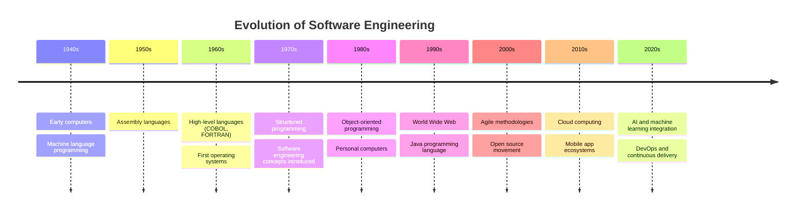
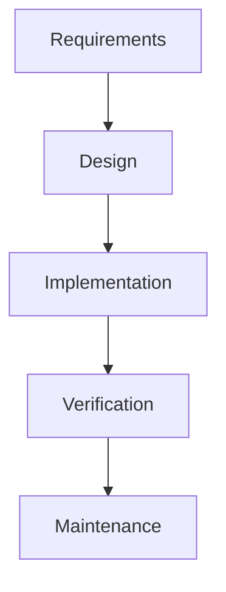
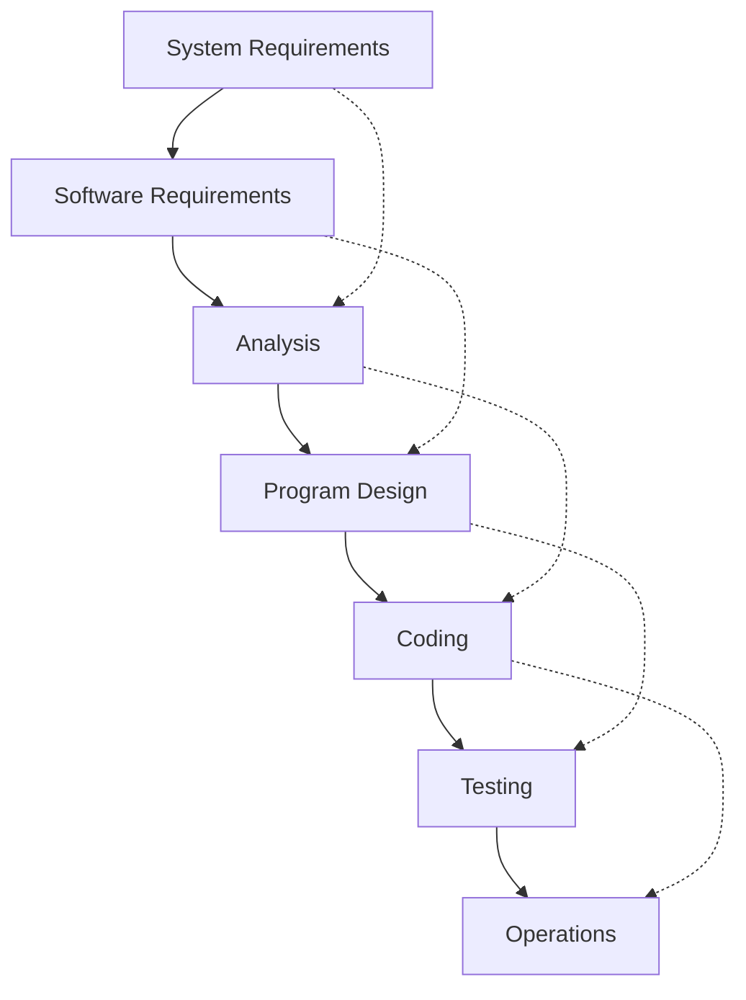
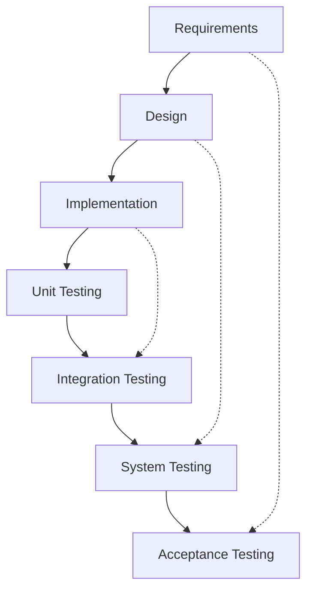

# Lecture 1: Introduction to Software Development and Traditional SDLC Models

## 1. Introduction to Software (10 minutes) 🖥️

### 1.1 What is Software?

Software is a set of instructions or programs that tell a computer how to perform specific tasks. It's the invisible force that powers our digital world, from simple mobile apps to complex operating systems.

### 1.2 Types of Software

1. **System Software**: Manages computer hardware and provides a platform for running application software.
   - Operating Systems (e.g., Windows, macOS, Linux)
   - Device drivers
   - Utilities

2. **Application Software**: Designed to perform specific tasks for users.
   - Word processors
   - Web browsers
   - Games
   - Mobile apps

3. **Programming Software**: Tools used by developers to create, debug, and maintain other software.
   - Integrated Development Environments (IDEs)
   - Compilers
   - Debuggers

### 1.3 Importance of Software in Modern Society

- 🏥 Healthcare: Electronic Health Records, Diagnostic tools
- 🏦 Finance: Online banking, Trading algorithms
- 🚗 Transportation: GPS navigation, Traffic management
- 🎓 Education: E-learning platforms, Educational apps
- 🏭 Industry: Automation, Supply chain management

## 2. History of Software Engineering (15 minutes) 📜

### 2.1 Timeline of Major Developments

### 2.2 Key Milestones

- **1968**: NATO Software Engineering Conference - Term "software engineering" first used
- **1970**: Winston Royce presents the Waterfall Model
- **1981**: James Martin develops Rapid Application Development (RAD)
- **1995**: Scrum and Extreme Programming (XP) methodologies introduced
- **2001**: Agile Manifesto published
- **2009**: DevOps movement begins

### 2.3 Evolution of Programming Paradigms

1. **Unstructured Programming**: Early days, no clear organization
2. **Structured Programming**: Emphasis on control structures and modularity
3. **Object-Oriented Programming**: Focus on objects that contain data and code
4. **Functional Programming**: Emphasis on functions and immutable data
5. **Aspect-Oriented Programming**: Separation of cross-cutting concerns

## 3. Software Development Methodologies (15 minutes) 🔄

### 3.1 What is a Software Development Methodology?

A software development methodology is a structured approach to designing, creating, and maintaining software systems. It provides a framework for organizing work and managing projects.

### 3.2 Components of a Software Development Methodology

1. **Phases**: Distinct stages of the development process
2. **Deliverables**: Outputs produced at each phase
3. **Roles**: Responsibilities assigned to team members
4. **Techniques**: Specific methods used to accomplish tasks
5. **Tools**: Software and resources used to support the process

### 3.3 Overview of Different Methodologies

1. **Plan-driven Methodologies**
   - Waterfall Model
   - V-Model
   - Rational Unified Process (RUP)

2. **Iterative and Incremental Methodologies**
   - Spiral Model
   - Rapid Application Development (RAD)

3. **Agile Methodologies**
   - Scrum
   - Extreme Programming (XP)
   - Kanban

4. **Lean Software Development**

5. **DevOps**

## 4. Traditional Software Development Models (15 minutes) 📊

### 4.1 Waterfall Model

The Waterfall Model is a linear sequential approach to software development.

#### Characteristics:
- Sequential phases
- Each phase must be completed before the next begins
- Emphasis on documentation

#### Pros:
- ✅ Simple and easy to understand
- ✅ Well-defined stages
- ✅ Works well for small projects with clear requirements

#### Cons:
- ❌ Inflexible to changes
- ❌ Testing starts late in the development process
- ❌ High risk and uncertainty

### 4.2 Classical Waterfall Model (Royce's Model)

The Classical Waterfall Model, proposed by Winston Royce in 1970, is an extension of the basic Waterfall Model, adding more phases for a more comprehensive approach.

#### Key Features:
- Feedback loops between adjacent phases
- Emphasis on documentation at each stage
- Clear division between development and operations

### 4.3 V-Model

The V-Model is a variation of the Waterfall Model that emphasizes testing.

#### Characteristics:
- Each development stage has a corresponding testing stage
- Emphasis on validation and verification

## 5. Traditional IT Organizations (5 minutes) 🏢

### 5.1 Structure of Traditional IT Organizations

- **Development Team**: Responsible for creating and coding new features
- **Quality Assurance Team**: Focuses on testing and identifying bugs
- **Operations Team**: Manages infrastructure and ensures smooth running of systems
- **Project Management**: Oversees project timelines and resource allocation

### 5.2 Challenges in Traditional IT Organizations

1. **Silos**: Limited communication between teams
2. **Conflicting Goals**: Dev team focuses on new features, Ops team on stability
3. **Slow Deployment**: Long cycles between development and production
4. **Resistance to Change**: Difficulty in adapting to new technologies or methodologies

## 6. Practical Example: Building a To-Do List Application (10 minutes) 📝

Let's apply the Waterfall Model to building a simple to-do list application:

1. **Requirements**:
   - User registration and login
   - Create, read, update, and delete tasks
   - Set due dates for tasks
   - Mark tasks as complete
   - Basic search functionality

2. **Design**:
   - Create UI mockups for all screens
   - Design database schema
   - Plan the program structure (classes, functions)

3. **Implementation**:
   - Set up the development environment
   - Implement user authentication
   - Develop CRUD operations for tasks
   - Create the user interface
   - Implement search functionality

4. **Verification**:
   - Unit testing for each component
   - Integration testing
   - User acceptance testing

5. **Maintenance**:
   - Deploy the application
   - Monitor for bugs and performance issues
   - Plan for future enhancements (e.g., task categories, reminders)

### Discussion Points:
- How might the development process change if requirements change midway?
- What challenges might arise from testing only after full implementation?
- How could an iterative approach benefit this project?

## Conclusion and Looking Ahead

Understanding traditional software development models provides a foundation for appreciating more modern, flexible approaches like Agile and DevOps, which we'll explore in upcoming lectures. While these models have limitations, they've played a crucial role in shaping the field of software engineering.

## Additional Resources

- Book: "Software Engineering" by Ian Sommerville
- Article: "Managing the Development of Large Software Systems" by Winston Royce
- Video: "The History of Software Engineering" by IEEE Computer Society

