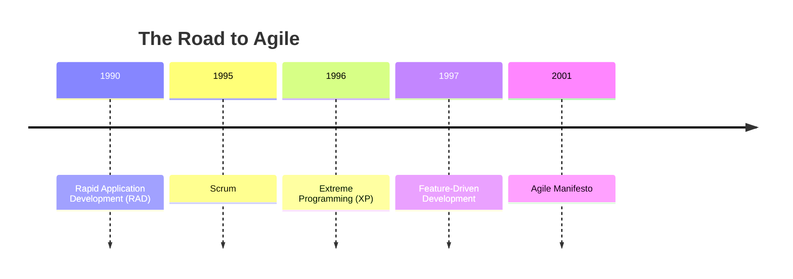
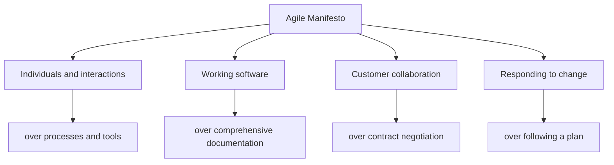
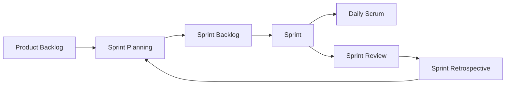

# Lecture 2: Agile Methodology and the Agile Manifesto

## 1. Introduction to Agile (10 minutes) 🚀

### 1.1 What is Agile?

Agile is an iterative approach to software development that emphasizes flexibility, collaboration, and rapid delivery of functional software.

### 1.2 The Birth of Agile

### 1.3 Why Agile?

- 🔄 Adaptability to changing requirements
- 👥 Better collaboration between developers and stakeholders
- 🚀 Faster time-to-market
- 🎯 Focus on customer satisfaction

## 2. The Agile Manifesto (15 minutes) 📜

### 2.1 Background

In February 2001, 17 software developers met in Utah to discuss lightweight development methods. The result was the Agile Manifesto.

### 2.2 The Four Values of the Agile Manifesto

1. **Individuals and interactions** over processes and tools
2. **Working software** over comprehensive documentation
3. **Customer collaboration** over contract negotiation
4. **Responding to change** over following a plan

### 2.3 The Twelve Principles of Agile Software

1. Customer satisfaction through early and continuous delivery
2. Welcome changing requirements, even late in development
3. Deliver working software frequently
4. Close, daily cooperation between business people and developers
5. Projects built around motivated individuals
6. Face-to-face conversation is the best form of communication
7. Working software is the primary measure of progress
8. Sustainable development, able to maintain a constant pace
9. Continuous attention to technical excellence and good design
10. Simplicity—the art of maximizing the amount of work not done
11. Self-organizing teams
12. Regular adaptation to changing circumstances

## 3. Agile Methodologies (20 minutes) 🔄

### 3.1 Scrum

Scrum is an agile framework for managing complex knowledge work, with an initial emphasis on software development.

#### Key Components:
- Sprint: Time-boxed iteration (usually 2-4 weeks)
- Product Backlog: Prioritized list of features
- Sprint Backlog: Selected items for the current sprint
- Daily Scrum: Daily stand-up meeting

### 3.2 Extreme Programming (XP)

XP is an agile software development framework that aims to produce higher quality software and higher quality of life for the development team.

#### Key Practices:
- Pair Programming
- Test-Driven Development (TDD)
- Continuous Integration
- Small Releases
- Simple Design

### 3.3 Kanban

Kanban is a visual system for managing work as it moves through a process.

#### Key Principles:
- Visualize the workflow
- Limit Work in Progress (WIP)
- Manage flow
- Make process policies explicit
- Implement feedback loops

## 4. Agile vs. Traditional Methods (10 minutes) ⚖️

### 4.1 Comparison Table

| Aspect | Agile | Traditional (Waterfall) |
|--------|-------|-------------------------|
| Approach | Iterative | Linear |
| Requirements | Evolving | Fixed |
| Customer Involvement | High | Low |
| Flexibility | High | Low |
| Deliverables | Working software increments | Comprehensive documentation |
| Project Size | Better for small to medium | Better for large, complex |
| Risk Management | Early risk identification | Risk addressed in later stages |

### 4.2 When to Use Agile

- Projects with evolving requirements
- When rapid delivery is crucial
- In innovative or uncertain environments

### 4.3 When Traditional Methods Might Be Preferred

- Projects with fixed requirements
- In highly regulated industries
- Large-scale, complex systems with many dependencies

## 5. Practical Example: Agile in Action (15 minutes) 🛠️

Let's apply Agile principles to the development of a mobile fitness app.

### 5.1 Initial Product Backlog

1. User registration and profile creation
2. Activity tracking (steps, distance, calories)
3. Workout routines
4. Nutrition logging
5. Social features (friend connections, challenges)
6. Progress reports and analytics
7. Integration with wearable devices

### 5.2 Sprint 1 (2 weeks)

#### Sprint Goal: Implement basic user registration and activity tracking

Sprint Backlog:
1. User registration
2. User profile creation
3. Basic step counting functionality

Daily Scrum Discussion Points:
- Progress on user registration API
- UI design for profile creation
- Challenges in implementing step counting algorithm

#### Sprint Review

Demo the working features to stakeholders and gather feedback.

#### Sprint Retrospective

- What went well?
- What could be improved?
- Action items for the next sprint

### 5.3 Adapting to Change

Scenario: After Sprint 1, the product owner informs the team that integration with a popular wearable device has become a high priority due to a potential partnership.

Discussion:
- How would an Agile team respond to this change?
- How does this differ from a traditional development approach?

## 6. Challenges and Criticisms of Agile (5 minutes) 🤔

- Lack of documentation
- Potential for scope creep
- Difficulty in estimating time and cost
- Challenges in scaling for large projects
- Misinterpretation and misapplication of Agile principles

## Conclusion and Looking Ahead

Agile methodologies have revolutionized software development by promoting flexibility, collaboration, and customer satisfaction. However, it's crucial to understand that Agile is not a one-size-fits-all solution. In our next lecture, we'll explore how DevOps builds upon Agile principles to further improve software development and delivery processes.

## Additional Resources

- Book: "Agile Software Development: Principles, Patterns, and Practices" by Robert C. Martin
- Article: "Embracing Agile" by Darrell K. Rigby, Jeff Sutherland, and Hirotaka Takeuchi (Harvard Business Review)
- Video: "Agile Product Ownership in a Nutshell" by Henrik Kniberg

