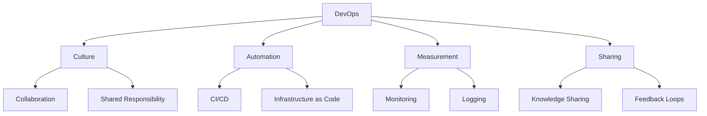
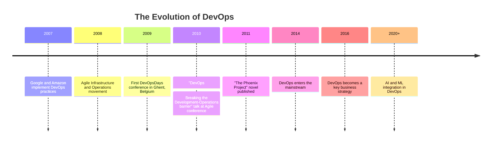
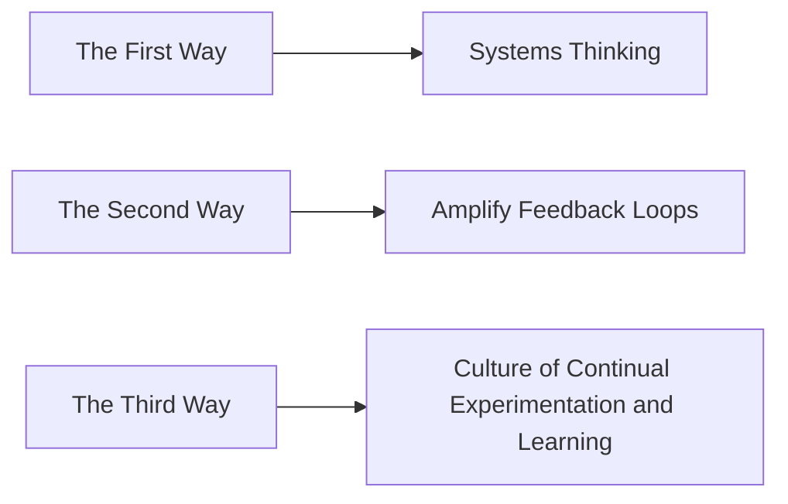
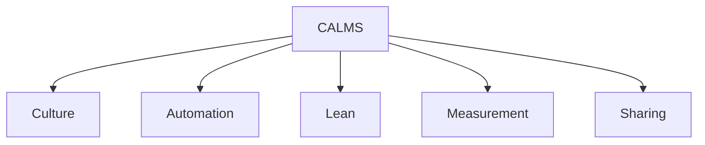

# Lecture 3: Introduction to DevOps: Definition, History, and Principles

## 1. What is DevOps? (10 minutes) 🤝

### 1.1 Definition

DevOps is a set of practices that combines software development (Dev) and IT operations (Ops). It aims to shorten the systems development life cycle and provide continuous delivery with high software quality.

### 1.2 Key Aspects of DevOps

1. **Culture**: Emphasizing collaboration and shared responsibility
2. **Automation**: Streamlining repetitive tasks
3. **Measurement**: Continuous monitoring and logging
4. **Sharing**: Encouraging knowledge sharing and feedback

## 2. History and Emergence of DevOps (15 minutes) 📜

### 2.1 Timeline of DevOps Evolution

### 2.2 Key Figures in DevOps Movement

- **Patrick Debois**: Considered the "Father of DevOps"
- **Gene Kim**: Co-author of "The Phoenix Project" and "The DevOps Handbook"
- **John Willis**: Co-author of "The DevOps Handbook"
- **Jez Humble**: Pioneer in Continuous Delivery

### 2.3 Factors Contributing to DevOps Emergence

1. Increasing complexity of software systems
2. Need for faster time-to-market
3. Growing adoption of cloud technologies
4. Limitations of traditional development and operations models

## 3. DevOps Principles (20 minutes) 🌟

### 3.1 Core Principles of DevOps

1. **Customer-Centric Action**: Focus on producing a product that provides value to the customer.

2. **End-to-End Responsibility**: The DevOps team is responsible for the entire product lifecycle.

3. **Continuous Improvement**: Strive to improve products and processes continuously.

4. **Automate Everything**: Automation of manual, repeatable processes is crucial.

5. **Work as One Team**: Breaking down silos between development and operations.

6. **Monitor and Validate Operational Quality**: Continuous monitoring of operational quality.

### 3.2 The Three Ways of DevOps

Introduced by Gene Kim in "The Phoenix Project":

1. **The First Way: Systems Thinking**
   - Focus on the overall flow of work through the entire value stream
   - Emphasize the performance of the entire system, not just a specific silo

2. **The Second Way: Amplify Feedback Loops**
   - Create right-to-left feedback loops
   - Shorten and amplify feedback to prevent problems from happening again

3. **The Third Way: Culture of Continual Experimentation and Learning**
   - Foster a culture that encourages taking risks and learning from failure
   - Understanding that repetition and practice are prerequisites to mastery

### 3.3 CALMS Framework

- **Culture**: Collaborative and open culture between developers and operations
- **Automation**: Consistent and repeatable practices
- **Lean**: Focusing on producing value for the customer
- **Measurement**: Measuring everything and using data to make decisions
- **Sharing**: Sharing ideas, processes, and tools

## 4. DevOps vs. Traditional IT (10 minutes) ⚖️

### 4.1 Comparison Table

| Aspect | DevOps | Traditional IT |
|--------|--------|----------------|
| Team Structure | Cross-functional teams | Siloed departments |
| Communication | Continuous and open | Limited and formal |
| Release Cycle | Frequent, small releases | Infrequent, large releases |
| Automation | High emphasis | Limited automation |
| Risk Management | Shared responsibility | Separate risk management |
| Focus | End-to-end product lifecycle | Specific phases of lifecycle |
| Flexibility | Highly adaptable | Rigid processes |

### 4.2 Benefits of DevOps over Traditional IT

- Faster time-to-market
- Improved collaboration and communication
- Higher quality and more reliable releases
- Increased efficiency through automation
- Better alignment with business objectives

## 5. Practical Example: Implementing DevOps in an E-commerce Company (15 minutes) 🛒

Let's consider a scenario where an e-commerce company decides to adopt DevOps practices.

### 5.1 Current State (Before DevOps)

- Separate development and operations teams
- Quarterly release cycles
- Manual testing and deployment processes
- Limited communication between teams

### 5.2 DevOps Implementation Plan

1. **Cultural Shift**
   - Organize cross-functional teams
   - Implement daily stand-up meetings
   - Encourage shared responsibility for product quality

2. **Automation**
   - Implement Continuous Integration/Continuous Deployment (CI/CD) pipeline
   - Automate testing processes
   - Use Infrastructure as Code for consistent environments

3. **Monitoring and Feedback**
   - Implement real-time monitoring of application performance
   - Set up automated alerts for issues
   - Create feedback loops from customers to development team

4. **Continuous Improvement**
   - Regular retrospectives to identify areas for improvement
   - Encourage experimentation and learning from failures

### 5.3 Results (After DevOps Implementation)

- Release cycle reduced from quarterly to weekly
- Improved application stability and performance
- Faster resolution of issues
- Increased customer satisfaction
- Better alignment between IT and business goals

## 6. Challenges in Adopting DevOps (5 minutes) 🚧

1. Resistance to cultural change
2. Legacy systems and technical debt
3. Lack of necessary skills and knowledge
4. Tool sprawl and integration issues
5. Balancing speed and security
6. Measuring DevOps success

## Conclusion and Looking Ahead

DevOps represents a significant shift in how organizations approach software development and IT operations. By fostering a culture of collaboration, automation, and continuous improvement, DevOps enables companies to deliver value to their customers more rapidly and efficiently. In our next lecture, we'll delve deeper into specific DevOps practices and tools that help achieve these goals.

## Additional Resources

- Book: "The DevOps Handbook" by Gene Kim, Jez Humble, Patrick Debois, and John Willis
- Article: "What is DevOps?" by Amazon Web Services (AWS)
- Video: "DevOps CI/CD Explained in 100 Seconds" by Fireship on YouTube
- Online Course: "Introduction to DevOps" on edX

