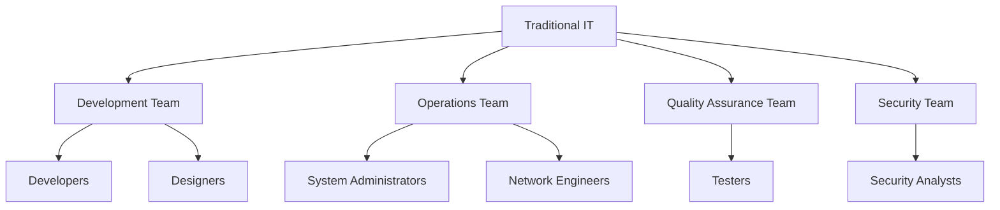
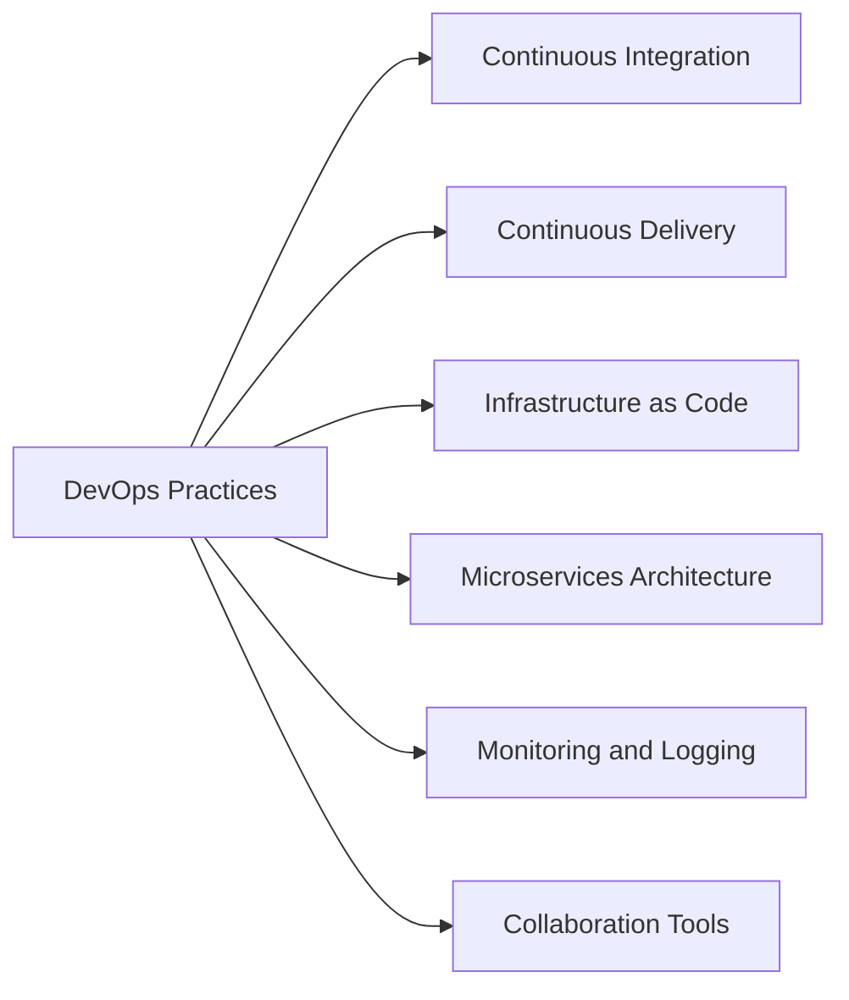

# Lecture 4: DevOps vs. Traditional IT: Challenges and Solutions

## 1. Overview of Traditional IT Organizations (10 minutes) 🏢

### 1.1 Structure of Traditional IT

### 1.2 Characteristics of Traditional IT

- Siloed departments
- Waterfall development model
- Infrequent, large releases
- Manual processes
- Limited cross-team communication

## 2. Challenges of Traditional IT Systems & Processes (15 minutes) 🚧

### 2.1 Key Challenges

1. **Slow Time to Market** ⏱️
   - Long development cycles
   - Lengthy approval processes

2. **Communication Gaps** 🗨️
   - Limited interaction between development and operations
   - Misalignment of goals and priorities

3. **Resistance to Change** 🔒
   - Risk-averse culture
   - Difficulty adapting to new technologies

4. **Inefficient Resource Utilization** 💼
   - Duplication of efforts
   - Underutilized infrastructure

5. **Quality and Reliability Issues** ⚠️
   - Late-stage testing
   - Difficulty reproducing production environments

6. **Limited Automation** 🤖
   - Manual, error-prone processes
   - Inconsistent environments

7. **Scalability Problems** 📈
   - Difficulty handling sudden spikes in demand
   - Manual scaling processes

### 2.2 Impact on Business

- Decreased competitiveness
- Higher costs
- Lower customer satisfaction
- Increased technical debt
- Difficulty attracting and retaining talent

## 3. DevOps: A Solution to Traditional IT Challenges (20 minutes) 🛠️

### 3.1 Key DevOps Practices Addressing Traditional IT Challenges

1. **Continuous Integration (CI)** 🔄
   - Frequent code integrations
   - Automated testing
   - Solution to: Quality issues, Slow time to market

2. **Continuous Delivery (CD)** 🚀
   - Automated deployment pipelines
   - Frequent, small releases
   - Solution to: Slow time to market, Inefficient resource utilization

3. **Infrastructure as Code (IaC)** 📝
   - Version-controlled infrastructure
   - Consistent environments
   - Solution to: Quality and reliability issues, Inefficient resource utilization

4. **Microservices Architecture** 🧩
   - Modular, independently deployable services
   - Improved scalability and flexibility
   - Solution to: Scalability problems, Resistance to change

5. **Monitoring and Logging** 📊
   - Real-time system visibility
   - Proactive issue detection
   - Solution to: Quality and reliability issues, Communication gaps

6. **Collaboration Tools** 👥
   - Shared platforms for communication
   - Cross-functional team collaboration
   - Solution to: Communication gaps, Resistance to change

### 3.2 DevOps Culture Shift

- Shared responsibility
- Emphasis on collaboration
- Continuous learning and improvement
- Embracing failure as a learning opportunity

## 4. Case Study: Traditional IT vs. DevOps in Action (15 minutes) 📊

Let's compare how a traditional IT organization and a DevOps-oriented organization handle a new feature deployment.

### Scenario: Deploying a New Payment Gateway in an E-commerce Platform

#### 4.1 Traditional IT Approach

1. **Requirements Gathering** (2 weeks)
   - Business analysts document requirements
   - Minimal developer involvement

2. **Development** (6 weeks)
   - Developers work in isolation
   - Limited communication with operations

3. **Quality Assurance** (3 weeks)
   - Separate QA team tests the feature
   - Bugs sent back to development

4. **Security Review** (1 week)
   - Security team conducts review
   - Potential for last-minute changes

5. **Deployment Planning** (1 week)
   - Operations team plans deployment
   - Potential for environment discrepancies

6. **Deployment** (1 day)
   - Manual deployment process
   - High risk of issues due to production environment differences

7. **Post-Deployment Support** (Ongoing)
   - Operations team monitors
   - Developers on standby for issues

**Total Time**: Approximately 13 weeks

#### 4.2 DevOps Approach

1. **Collaborative Planning** (3 days)
   - Cross-functional team defines MVP
   - Developers, ops, and security involved from the start

2. **Development with CI/CD** (3 weeks)
   - Short development cycles with frequent integrations
   - Automated testing at each stage

3. **Continuous Security Checks** (Ongoing)
   - Automated security scans in CI/CD pipeline
   - Security team consulted as needed

4. **Infrastructure as Code** (1 week, parallel to development)
   - Environment configurations version-controlled
   - Consistent dev, test, and prod environments

5. **Automated Deployment** (1 day)
   - Deployment triggered through CI/CD pipeline
   - Canary or blue-green deployment strategies

6. **Monitoring and Feedback** (Ongoing)
   - Real-time monitoring of system performance
   - Quick rollback if issues detected

**Total Time**: Approximately 4 weeks

### 4.3 Comparison of Outcomes

| Aspect | Traditional IT | DevOps |
|--------|----------------|--------|
| Time to Market | 13 weeks | 4 weeks |
| Risk of Deployment Failures | High | Low |
| Ability to Quickly Address Issues | Limited | High |
| Cross-team Collaboration | Minimal | Extensive |
| Automation Level | Low | High |
| Flexibility to Change | Low | High |

## 5. Implementing DevOps: Overcoming Challenges (10 minutes) 🏆

### 5.1 Common Obstacles in DevOps Adoption

1. Resistance to cultural change
2. Lack of necessary skills
3. Legacy systems and technical debt
4. Tool sprawl and integration issues
5. Security and compliance concerns

### 5.2 Strategies for Successful DevOps Implementation

1. **Start Small, Scale Gradually**
   - Begin with a pilot project
   - Demonstrate value before expanding

2. **Invest in Training and Education**
   - Upskill existing staff
   - Hire for DevOps mindset

3. **Emphasize Cultural Transformation**
   - Foster a blame-free culture
   - Encourage experimentation and learning

4. **Standardize and Integrate Tools**
   - Create a cohesive toolchain
   - Focus on interoperability

5. **Incorporate Security from the Start (DevSecOps)**
   - Integrate security into the CI/CD pipeline
   - Collaborate closely with security teams

6. **Measure and Communicate Success**
   - Define clear KPIs
   - Regularly share achievements and learnings

## Conclusion and Looking Ahead

The transition from traditional IT to DevOps represents a significant shift in how organizations approach software development and operations. While challenges exist, the benefits of increased agility, faster time to market, and improved quality make DevOps an essential consideration for modern businesses. In our next lecture, we'll explore the concept of Minimum Viable Product (MVP) and its role in DevOps and Agile methodologies.

## Additional Resources

- Book: "The Phoenix Project" by Gene Kim, Kevin Behr, and George Spafford
- Article: "Overcoming DevOps Challenges" on TechBeacon
- Video: "DevOps vs Traditional IT" by IBM Technology on YouTube
- Online Course: "DevOps Culture and Mindset" on Coursera

