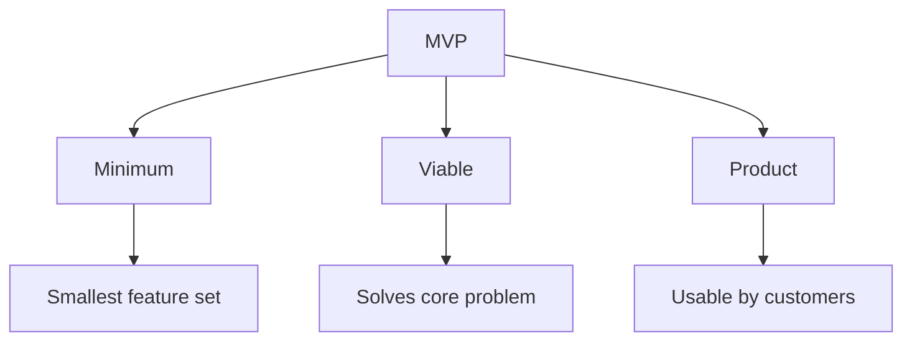
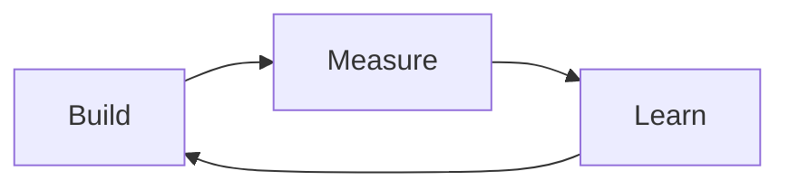

# Lecture 5: Minimum Viable Product (MVP) and Its Benefits

## 1. Introduction to MVP (10 minutes) 🚀

### 1.1 What is an MVP?

A Minimum Viable Product (MVP) is the version of a new product that allows a team to collect the maximum amount of validated learning about customers with the least effort.

### 1.2 Origins of MVP

- Coined by Frank Robinson in 2001
- Popularized by Eric Ries in "The Lean Startup" (2011)

### 1.3 The MVP Concept

- **Minimum**: The smallest possible feature set
- **Viable**: Solves the core problem for users
- **Product**: Something customers can actually use

## 2. The Purpose of MVP (15 minutes) 🎯

### 2.1 Key Objectives of MVP

1. **Validate Product-Market Fit**
   - Test if the product solves a real problem
   - Gauge market demand

2. **Gather User Feedback**
   - Understand user needs and preferences
   - Identify areas for improvement

3. **Minimize Development Costs**
   - Reduce initial investment
   - Focus resources on essential features

4. **Accelerate Time-to-Market**
   - Launch quickly to gain early adopters
   - Stay ahead of competitors

5. **Learn and Iterate**
   - Use real-world data to guide development
   - Adapt based on user behavior

### 2.2 The Build-Measure-Learn Cycle

- **Build**: Create the MVP
- **Measure**: Collect data on user interactions
- **Learn**: Analyze data and derive insights

## 3. Benefits of MVP (20 minutes) 💡

### 3.1 For Product Development

1. **Risk Reduction**
   - Minimize the risk of building the wrong product
   - Identify potential issues early

2. **Resource Optimization**
   - Focus on essential features
   - Avoid wasting resources on unnecessary elements

3. **Faster Time-to-Market**
   - Launch sooner with core functionality
   - Gain competitive advantage

4. **Flexibility and Adaptability**
   - Easily pivot based on feedback
   - Evolve product in line with market needs

### 3.2 For Business

1. **Cost-Effective**
   - Lower initial development costs
   - Reduce the risk of expensive failures

2. **Early Revenue Generation**
   - Start monetizing sooner
   - Attract potential investors with a working product

3. **Market Validation**
   - Prove concept before full-scale investment
   - Understand target audience better

4. **Competitive Intelligence**
   - Gain insights into market dynamics
   - Identify potential competitors early

### 3.3 For Customers

1. **Early Access to Solutions**
   - Get problems solved sooner
   - Influence product development

2. **Better Final Product**
   - Product evolves based on real user needs
   - Higher satisfaction with end result

3. **Sense of Ownership**
   - Feel involved in the development process
   - Stronger connection with the brand

### 3.4 MVP in Different Contexts

| Context | MVP Approach | Benefits |
|---------|--------------|----------|
| Startups | Lean, basic product | Quick market entry, cost-effective |
| Enterprise | Pilot program or limited release | Risk mitigation, stakeholder buy-in |
| Open Source | Core functionality release | Community engagement, distributed development |
| Hardware | 3D printed prototype or simulation | Cost reduction, faster iterations |

## 4. MVP vs. Other Product Development Approaches (10 minutes) ⚖️

### 4.1 Comparison Table

| Aspect | MVP | Prototype | Proof of Concept | Fully Featured Product |
|--------|-----|-----------|-------------------|------------------------|
| Purpose | Validate market need | Test design or functionality | Verify feasibility | Comprehensive solution |
| Scope | Core features only | May be non-functional | Specific aspect or technology | All planned features |
| User Interaction | Real users | Limited user testing | Usually internal | Full user base |
| Time to Develop | Short | Very short | Short to medium | Long |
| Cost | Low | Very low | Low to medium | High |
| Risk | Medium | Low | Low | High |

### 4.2 When to Use MVP

- When entering a new market
- For startups with limited resources
- When the problem-solution fit is uncertain
- In rapidly changing markets

## 5. Case Study: Dropbox MVP (15 minutes) 📂

### 5.1 The Problem

- Existing file synchronization solutions were complex and unreliable
- Founder Drew Houston experienced personal frustration with forgetting his USB flash drive

### 5.2 The MVP Approach

Instead of building a full product, Dropbox created a simple video demo:

1. **Content**: 3-minute video explaining Dropbox's functionality
2. **Target**: Posted on Hacker News and Digg
3. **Call to Action**: Sign up for the beta waiting list

### 5.3 Results

- Beta waiting list grew from 5,000 to 75,000 overnight
- Validated market demand without writing a single line of code
- Provided valuable user feedback for feature prioritization

### 5.4 Lessons Learned

1. MVP doesn't always mean a working product
2. Understanding your target audience is crucial (tech-savvy early adopters)
3. Solving a real, relatable problem resonates with users
4. Simplicity in explanation can be powerful

## 6. Implementing MVP in DevOps (5 minutes) 🔄

### 6.1 MVP and DevOps Synergy

- Continuous delivery aligns with MVP's iterative nature
- Automated testing ensures MVP quality
- Infrastructure as Code facilitates rapid deployment of MVP versions

### 6.2 Best Practices

1. Define clear success metrics for each MVP iteration
2. Use feature flags to control rollout of new features
3. Implement robust monitoring to gather user behavior data
4. Maintain a backlog of features for future iterations
5. Engage in continuous user feedback loops

## Conclusion and Looking Ahead

The Minimum Viable Product approach is a powerful tool in modern product development, allowing teams to validate ideas quickly and efficiently. By focusing on core functionality and embracing iterative development, MVP aligns closely with DevOps principles of continuous improvement and delivery. In our next lecture, we'll explore Continuous Integration (CI) and its role in the DevOps pipeline.

## Additional Resources

- Book: "The Lean Startup" by Eric Ries
- Article: "The Ultimate Guide to Minimum Viable Products" on ProductPlan
- Video: "Dropbox MVP Case Study" on YouTube
- Online Course: "Developing Innovative Ideas for New Companies" on Coursera

