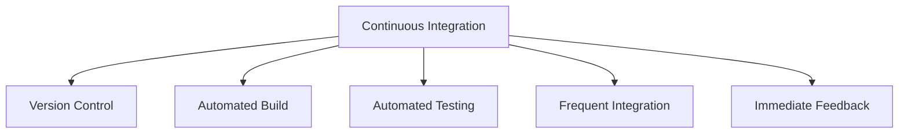

# Lecture 6: Continuous Integration: Best Practices and Benefits

## 1. Introduction to Continuous Integration (10 minutes) 🔄

### 1.1 What is Continuous Integration (CI)?

Continuous Integration is a software development practice where members of a team integrate their work frequently, usually each person integrates at least daily - leading to multiple integrations per day.

### 1.2 Key Components of CI

1. **Version Control**: Centralized code repository
2. **Automated Build**: Script-driven compilation and linking
3. **Automated Testing**: Running unit and integration tests automatically
4. **Frequent Integration**: Merging code changes multiple times a day
5. **Immediate Feedback**: Quick notification of build or test failures

### 1.3 CI Pipeline

## 2. Best Practices of Continuous Integration (20 minutes) 🌟

### 2.1 Maintain a Single Source Repository

- Use version control systems (e.g., Git, SVN)
- All code and assets in one place
- Clear branching strategy

### 2.2 Automate the Build

- Use build automation tools (e.g., Maven, Gradle, Make)
- Include all steps: compile, link, package
- Build should be platform-independent

### 2.3 Make Your Build Self-Testing

- Include automated tests in the build process
- Cover unit tests, integration tests, and possibly UI tests
- Aim for high test coverage

### 2.4 Everyone Commits to the Mainline Every Day

- Frequent small commits rather than infrequent large ones
- Helps identify conflicts early
- Encourages completion of tasks

### 2.5 Every Commit Should Build the Mainline on an Integration Machine

- Detect integration problems early
- Ensure the build works on a clean machine
- Use CI servers (e.g., Jenkins, Travis CI, GitLab CI)

### 2.6 Keep the Build Fast

- Aim for builds under 10 minutes
- Parallelize tests when possible
- Use incremental builds

### 2.7 Test in a Clone of the Production Environment

- Minimize differences between development and production
- Use containerization (e.g., Docker) for consistency
- Include data and configuration in tests

### 2.8 Make it Easy for Anyone to Get the Latest Executable

- Automated deployment to a staging area
- Clear versioning of builds
- Easy rollback mechanism

### 2.9 Everyone Can See What's Happening

- Visible displays of build status
- Notifications for build failures (e.g., email, Slack)
- Dashboards for build and test metrics

### 2.10 Automate Deployment

- Script your deployments
- Use configuration management tools (e.g., Ansible, Puppet)
- Implement blue-green or canary deployments

## 3. Benefits of Continuous Integration (15 minutes) 💡

### 3.1 For Development Teams

1. **Reduced Integration Problems**
   - Catch conflicts early
   - Smaller, more manageable changes

2. **Improved Code Quality**
   - Frequent testing catches bugs earlier
   - Encourages writing testable code

3. **Faster Development Cycles**
   - Immediate feedback on changes
   - Reduced time spent on debugging

4. **Increased Visibility**
   - Team-wide awareness of project status
   - Early warning of broken builds or failed tests

### 3.2 For Business

1. **Reduced Costs**
   - Lower risk of expensive bugs in production
   - More efficient use of developer time

2. **Faster Time-to-Market**
   - Shorter release cycles
   - Ability to respond quickly to market changes

3. **Improved Customer Satisfaction**
   - Higher quality products
   - Faster bug fixes and feature releases

4. **Better Project Predictability**
   - Clear picture of project health
   - Early identification of issues

### 3.3 Quantifiable Benefits

| Metric | Without CI | With CI |
|--------|------------|---------|
| Time to market | Weeks/Months | Days/Weeks |
| Bug detection time | Days/Weeks | Minutes/Hours |
| Deployment frequency | Monthly/Quarterly | Daily/Weekly |
| Change failure rate | 60-90% | 0-15% |
| Mean time to recovery | Hours/Days | Minutes/Hours |

## 4. CI Tools and Technologies (10 minutes) 🛠️

### 4.1 Popular CI/CD Tools

1. **Jenkins**
   - Open-source
   - Highly customizable
   - Large plugin ecosystem

2. **GitLab CI**
   - Integrated with GitLab
   - YAML-based configuration
   - Built-in Docker support

3. **Travis CI**
   - Cloud-based
   - Easy setup for GitHub projects
   - Free for open-source projects

4. **CircleCI**
   - Cloud and on-premises options
   - Fast build times
   - Docker and VM support

5. **GitHub Actions**
   - Integrated with GitHub
   - YAML-based workflows
   - Large marketplace of actions

### 4.2 Complementary Technologies

- **Docker**: Containerization for consistent environments
- **Kubernetes**: Container orchestration for scalable deployments
- **Terraform**: Infrastructure as Code for consistent environments
- **SonarQube**: Code quality and security analysis

## 5. Case Study: Implementing CI at Etsy (15 minutes) 🛍️

### 5.1 Background

- Etsy: E-commerce website for handmade or vintage items
- Challenge: Moving from bi-monthly deployments to continuous deployment

### 5.2 CI Implementation Steps

1. **Version Control**: Migrated to Git for better branching and merging
2. **Automated Testing**: Implemented comprehensive unit and integration tests
3. **Build Automation**: Created a custom build system called 'Try'
4. **Deployment Pipeline**: Developed 'Deployinator' for one-click deployments
5. **Monitoring**: Implemented extensive logging and real-time monitoring

### 5.3 Results

- Deployment frequency increased from bi-monthly to 50+ times per day
- Mean time to recovery decreased from hours to minutes
- Developer productivity significantly improved
- Able to quickly respond to market trends and user feedback

### 5.4 Lessons Learned

1. Culture change is as important as tooling
2. Invest in robust testing and monitoring
3. Empower developers with self-service tools
4. Gradual implementation can lead to big improvements

## 6. Challenges and Solutions in CI Adoption (5 minutes) 🚧

### 6.1 Common Challenges

1. Resistance to frequent commits
2. Long build times
3. Flaky tests
4. Environment inconsistencies
5. Legacy code without tests

### 6.2 Solutions

1. Education and clear guidelines on commit practices
2. Optimize build processes, use build caching
3. Invest in stable test infrastructure, quarantine flaky tests
4. Use containerization for consistent environments
5. Gradually increase test coverage, prioritize critical paths

## Conclusion and Looking Ahead

Continuous Integration is a fundamental practice in modern software development, enabling teams to deliver high-quality software faster and more reliably. By integrating frequently and catching issues early, CI sets the stage for Continuous Delivery and Deployment, which we'll explore in our next lecture.

## Additional Resources

- Book: "Continuous Integration: Improving Software Quality and Reducing Risk" by Paul Duvall
- Article: "Continuous Integration" by Martin Fowler
- Video: "Continuous Integration Best Practices" by JetBrains on YouTube
- Online Course: "Continuous Integration and Continuous Delivery" on Coursera

