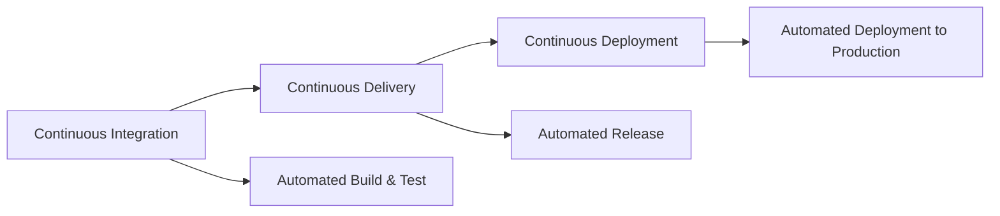
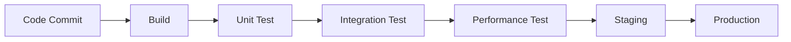
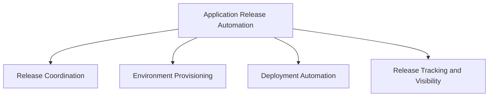
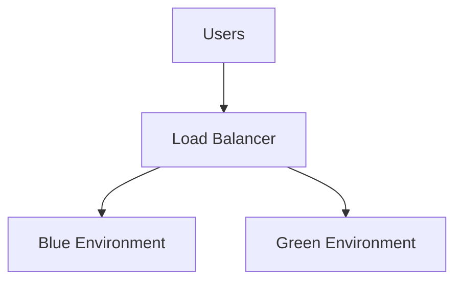

# Lecture 7: Continuous Delivery and Application Release Automation (ARA)

## 1. Introduction to Continuous Delivery (10 minutes) 🚀

### 1.1 What is Continuous Delivery (CD)?

Continuous Delivery is a software engineering approach in which teams produce software in short cycles, ensuring that the software can be reliably released at any time.

### 1.2 CD vs. CI vs. Continuous Deployment

- **Continuous Integration**: Automating the build and testing of code
- **Continuous Delivery**: Extending CI to ensure software can be released at any time
- **Continuous Deployment**: Automatically deploying every change to production

### 1.3 Key Principles of Continuous Delivery

1. Build quality in
2. Work in small batches
3. Automate repetitive tasks
4. Pursue continuous improvement
5. Everyone is responsible for the delivery process

## 2. The Continuous Delivery Pipeline (15 minutes) 🔄

### 2.1 Stages of a CD Pipeline

1. **Build**: Compile code and create artifacts
2. **Unit Test**: Test individual components
3. **Integration Test**: Test interaction between components
4. **Performance Test**: Assess system performance
5. **Staging**: Deploy to a production-like environment
6. **Production**: Deploy to live environment

### 2.2 Key Components of CD

1. **Version Control**: Track changes and manage code versions
2. **Configuration Management**: Manage environment configurations
3. **Continuous Integration**: Automate build and test processes
4. **Deployment Automation**: Script and automate deployments
5. **Environment Management**: Maintain consistency across environments
6. **Monitoring and Logging**: Track system health and performance

## 3. Application Release Automation (ARA) (15 minutes) 🤖

### 3.1 What is ARA?

Application Release Automation is the process of packaging and deploying an application from development, across various environments, to production in an automated fashion.

### 3.2 Components of ARA

1. **Release Coordination**: Manage and orchestrate the release process
2. **Environment Provisioning**: Automatically set up required environments
3. **Deployment Automation**: Script and automate the deployment process
4. **Release Tracking and Visibility**: Monitor and report on release status

### 3.3 Benefits of ARA

1. **Consistency**: Ensure reliable and repeatable releases
2. **Speed**: Accelerate the release process
3. **Quality**: Reduce human errors in deployments
4. **Compliance**: Maintain audit trails for regulatory requirements
5. **Scalability**: Handle complex, multi-tier application releases

## 4. Best Practices for CD and ARA (20 minutes) 🌟

### 4.1 Automate Everything

- Use Infrastructure as Code (IaC) for environment provisioning
- Implement automated testing at all levels
- Automate deployment processes

### 4.2 Use Feature Toggles

- Decouple deployment from release
- Enable/disable features without code changes
- Facilitate A/B testing and canary releases

### 4.3 Implement Blue-Green Deployments

- Maintain two identical production environments
- Switch traffic between environments for zero-downtime deployments

### 4.4 Utilize Canary Releases

- Release to a small subset of users first
- Gradually increase the user base
- Monitor for issues before full release

### 4.5 Implement Robust Monitoring and Logging

- Use application performance monitoring (APM) tools
- Implement centralized logging
- Set up alerts for key metrics

### 4.6 Embrace DevOps Culture

- Foster collaboration between development and operations
- Encourage shared responsibility for the entire application lifecycle
- Promote continuous learning and improvement

### 4.7 Maintain a Comprehensive Test Suite

- Implement unit, integration, and end-to-end tests
- Include performance and security tests
- Continuously update and maintain test cases

### 4.8 Version Control Everything

- Include application code, tests, and configuration in version control
- Use branching strategies (e.g., GitFlow, trunk-based development)

### 4.9 Implement Rollback Strategies

- Plan for failures
- Automate rollback procedures
- Regularly test rollback capabilities

## 5. Tools for CD and ARA (10 minutes) 🛠️

### 5.1 Continuous Delivery Tools

1. **Jenkins**: Open-source automation server
2. **GitLab CI/CD**: Integrated CI/CD with GitLab
3. **CircleCI**: Cloud-based CI/CD platform
4. **Spinnaker**: Multi-cloud continuous delivery platform
5. **Argo CD**: Declarative GitOps CD for Kubernetes

### 5.2 Application Release Automation Tools

1. **XebiaLabs XL Release**: Enterprise-scale release orchestration
2. **Octopus Deploy**: Deployment automation for .NET and Java
3. **IBM UrbanCode Deploy**: Application deployment automation
4. **Puppet Enterprise**: Infrastructure automation and orchestration
5. **Chef Automate**: Infrastructure automation platform

## 6. Case Study: Continuous Delivery at Netflix (15 minutes) 📺

### 6.1 Background

- Netflix: Leading streaming service with millions of global users
- Challenge: Delivering frequent updates to a large-scale, distributed system

### 6.2 CD Implementation

1. **Microservices Architecture**: Break down monolith into smaller, manageable services
2. **Immutable Infrastructure**: Use Amazon EC2 instances for consistent environments
3. **Automated Canary Analysis**: Develop Spinnaker for automated deployments
4. **Chaos Engineering**: Implement tools like Chaos Monkey to test system resilience
5. **Feature Toggles**: Use feature flags for gradual rollouts and A/B testing

### 6.3 Results

- Ability to deploy thousands of times per day
- Reduced time-to-market for new features
- Improved system reliability and uptime
- Enhanced ability to experiment and innovate

### 6.4 Lessons Learned

1. Embrace cloud technologies for scalability
2. Invest in robust monitoring and alerting
3. Build a culture of automation and continuous improvement
4. Prioritize system resilience and self-healing capabilities

## Conclusion and Course Wrap-up (5 minutes)

Continuous Delivery and Application Release Automation are crucial practices in modern software development, enabling organizations to deliver value to customers quickly and reliably. By automating the build, test, and deployment processes, teams can focus on innovation and delivering high-quality software.

Throughout this course, we've covered:
1. Traditional SDLC Models and their challenges
2. Introduction to DevOps and its principles
3. Agile Methodologies
4. Minimum Viable Product (MVP)
5. Continuous Integration
6. Continuous Delivery and ARA

These practices and principles form the foundation of modern software development and operations. As you move forward in your careers, remember that the field is constantly evolving. Stay curious, keep learning, and always strive to improve your processes and practices.

## Additional Resources

- Book: "Continuous Delivery: Reliable Software Releases through Build, Test, and Deployment Automation" by Jez Humble and David Farley
- Article: "Continuous Delivery" on Martin Fowler's website
- Video: "Continuous Delivery vs. Continuous Deployment" by Atlassian on YouTube
- Online Course: "Continuous Delivery & DevOps" on Coursera

